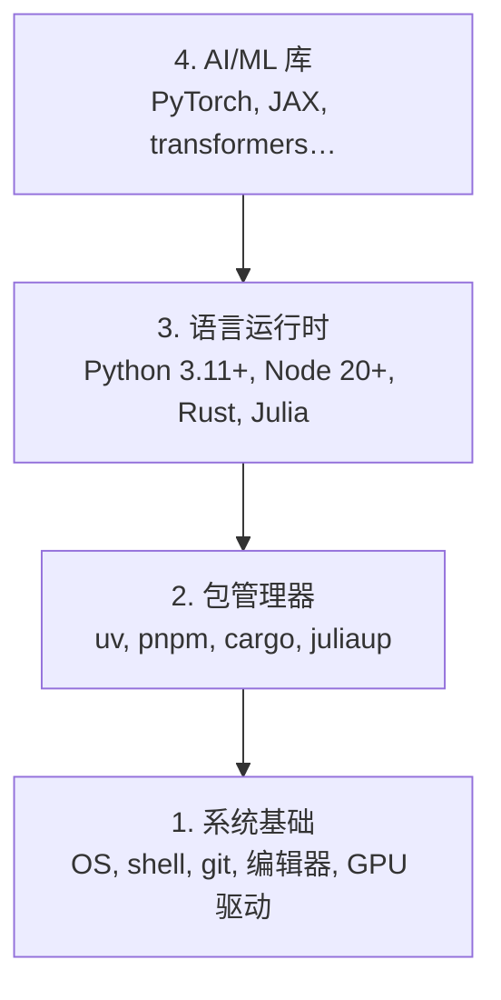

# 00-setup-and-tooling · 01-dev-environment 学习笔记

> 科目：AI 工程课程（ai-engineering-from-scratch）
> 阶段：Phase 0 Setup & Tooling（第一阶段）· 第一小节 Dev Environment
> 类型：Build（环境搭建）· 语言：Python / Node.js / Rust / Julia
> 日期：2026-08-27
> 状态：✅ 完成（verify.py 2/2 PASS）

---

## 0. 核心概念：四层架构

AI 工程环境分四层，**从下往上装**，每层依赖下一层：



| 层 | 本机已装 | 用途 |
|---|---|---|
| 1 系统基础 | WSL2 + Ubuntu 24.04.4 + gcc 13.3.0 | Linux 环境、C 编译器 |
| 2 包管理器 | uv 0.12.5 / fnm 1.39.0 / rustup / juliaup | 装语言和包 |
| 3 语言运行时 | Python 3.12.14 / Node v22.23.2 / Rust 1.98.0 / Julia 1.12.7 | 跑代码 |
| 4 AI 库 | numpy 2.5.2 / matplotlib / jupyter | 机器学习 |

---

## 1. Step 1：系统基础（WSL2）

### 命令及作用

```bash
# Windows PowerShell（管理员）
wsl --install -d Ubuntu-24.04   # 安装 WSL2 + Ubuntu 24.04

# Ubuntu 内
sudo apt update                 # 更新软件源索引
sudo apt install -y build-essential git curl wget   # C 工具链 + 常用工具
```

- `build-essential`：包含 gcc/g++/make——**Rust 编译 C 依赖时必需**（漏装会报 `no default linker (cc)`）
- 本机核对：WSL 2.6.3.0、Ubuntu 24.04.4 LTS、gcc 13.3.0

### 遇到的问题

| 问题 | 现象 | 原因 | 解决 |
|---|---|---|---|
| ⚠️ 代理警告 | `wsl: 检测到 localhost 代理配置，但未镜像到 WSL。NAT 模式下的 WSL 不支持 localhost 代理` | Windows 代理只监听 localhost，WSL 默认 NAT 模式访问不到 | 平时无害；下载卡住时配 `C:\Users\dyz\.wslconfig` 加 `[wsl2] networkingMode=mirrored` 或临时 `export https_proxy=http://<WindowsIP>:<端口>` |
| 🔴 SSH 被掐 | `Connection closed by 198.18.1.38 port 22` | 代理 fake-ip（198.18.x.x）掐了 22 端口 | `~/.ssh/config` 配 `Host github.com → HostName ssh.github.com Port 443`（SSH over 443） |
| 🟡 nvidia-smi 不存在 | `Command 'nvidia-smi' not found` | 无 N 卡（华为笔记本） | **正常**，不要装 nvidia-utils；课程多数 CPU 可跑，训练重的用 Colab |

---

## 2. Step 2：Python + uv

### 命令及作用

```bash
curl -LsSf https://astral.sh/uv/install.sh | sh   # 装 uv（安装到 ~/.local/bin）
source ~/.bashrc                                   # ★ 重载 PATH，否则 uv 找不到
uv python install 3.12                             # uv 下载并管理 Python 3.12（存 ~/.local/share/uv/python）
uv venv                                            # 在【项目根】创建虚拟环境 .venv
source .venv/bin/activate                          # 激活（提示符出现 (venv)）
uv pip install numpy matplotlib jupyter            # 装包（uv 比 pip 快 10-100x）
```

验证：

```python
import sys
print(f"Python {sys.version}")
import numpy as np
print(f"NumPy {np.__version__}")
a = np.array([1, 2, 3])
print(f"dot: {np.dot(a, a)}")     # 应为 14
```

### 遇到的问题（重点！）

| 问题 | 现象 | 原因 | 解决 |
|---|---|---|---|
| 🔴 `uv` not found | `Command 'uv' not found` | 装完没重载 shell | `source ~/.bashrc`（或重开终端） |
| 🔴 `python` not found | `Command 'python' not found` | Ubuntu 默认只有 `python3`，没有 `python` | **激活 venv 后才有 python**；或 `sudo apt install python-is-python3` |
| 🔴 numpy 找不到 | `ModuleNotFoundError: No module named 'numpy'` | **没在 venv 里**，用的是系统 Python 3.12.3 | `source .venv/bin/activate` 后再跑；用 `which python` 判断（应指向 `.venv/bin/python`） |
| 🟡 三个 Python 混淆 | 系统 3.12.3 / uv 3.12.14 / venv Python | 三套解释器并存 | 记住：**激活 venv 后 `python` 才是带包的**；`which python` 验证 |
| 🟡 venv 建在家目录 | `~/.venv` 无主 | 在 `~` 下跑了 `uv venv` | **venv 必须建在项目根**：`cd 项目根 && uv venv` |
| 🔴 mv 改名后 venv 失效 | 激活后 `python` not found、提示符显示旧目录名 | venv 的 activate 脚本**硬编码创建时的绝对路径**，目录一移动就坏 | 删掉重建：`rm -rf .venv && uv venv && source .venv/bin/activate`（uv 缓存，秒装） |
| 🔴 在家目录输 Python 代码报错 | `-bash: syntax error near unexpected token` | 把 Python 代码直接敲进了 bash | 先 `python` 进解释器（提示符变 `>>>`），或用 `python -c "..."` |

### venv 铁律

1. **venv 是项目的私有物**，建在项目根目录（`.venv/`），不进家目录；
2. **`.venv` 永远不进 git**（已被 `.gitignore` 忽略），环境靠 `requirements.txt` 重建：
   ```bash
   uv venv && source .venv/bin/activate
   uv pip install -r requirements.txt
   ```
3. **venv 认出生地**：`mv` 移动目录 = 弄坏 venv，必须重建；
4. 每次新开终端：`cd 项目根 && source .venv/bin/activate`（配别名 `goai` 一键搞定）。

---

## 3. Step 3：Node.js + pnpm

### 命令及作用

```bash
curl -fsSL https://fnm.vercel.app/install | bash   # 装 fnm（Node 版本管理器，~/.fnm）
source ~/.bashrc                                   # ★ 重载
fnm install 22                                     # 安装 Node 22（存 ~/.fnm/node-versions）
fnm use 22                                         # 切换当前 shell 到 Node 22
npm install -g pnpm                                # 全局装 pnpm（依赖 npm）
node -e "console.log('Node', process.version)"     # 验证
pnpm --version
```

- fnm = Fast Node Manager：按项目切换 Node 版本，类似 uv 之于 Python
- 课程要求 Node 20+，本机 v22.23.2 ✅

### 遇到的问题

| 问题 | 现象 | 原因 | 解决 |
|---|---|---|---|
| 🔴 fnm 装不上 | `Checking availability of unzip... Missing! Not installing fnm` | 系统缺 `unzip`（fnm 解压 Node 用） | `sudo apt update && sudo apt install -y unzip` 后重跑安装 |
| 🟡 macOS 提示误读 | Rosetta 2 那段 `arch -arm64 brew install fnm` | 那是 macOS 专用 | **WSL/Linux 用户完全跳过** |

---

## 4. Step 4：Rust

### 命令及作用

```bash
curl --proto '=https' --tlsv1.2 -sSf https://sh.rustup.rs | sh   # 装 rustup（~/.rustup + ~/.cargo）
# 交互提示直接回车选默认 1
source ~/.bashrc                                    # ★ 重载（rustup 改 .bashrc 加 PATH）
rustc --version
cargo --version
```

### 遇到的问题

| 问题 | 现象 | 原因 | 解决 |
|---|---|---|---|
| 🔴 缺 C 链接器 | `warn: no default linker (cc) was found` | 没装 build-essential | `sudo apt install -y build-essential`（装完 `gcc --version` 验证） |
| 🟡 编译测试 | 想验证编译链路 | — | `rustc hello.rs -o hello && ./hello` |

---

## 5. Step 5：Julia（可选）

### 命令及作用

```bash
curl -fsSL https://install.julialang.org | sh   # 装 juliaup + Julia（~/.juliaup）
# 交互提示回车选默认 Proceed
source ~/.bashrc
julia -e 'println("Julia ", VERSION)'
```

本机 Julia 1.12.7 ✅（用于数学类课程，可跳过不装）。

### 遇到的问题

| 问题 | 现象 | 原因 | 解决 |
|---|---|---|---|
| 🟡 getcwd failed | `sh: 0: getcwd() failed: No such file or directory` | shell 停在已删除的目录里 | `cd ~` 回可访问目录（安装本身不受影响） |

---

## 6. Step 6：GPU（本机跳过）

```bash
nvidia-smi
```

- 有 N 卡（Linux/WSL）才需要，装 PyTorch 用 `--index-url https://download.pytorch.org/whl/cu124`
- macOS 用 MPS，**不要**加 cuXXX index
- 本机无 N 卡 → 跳过，CPU 跑 + Colab 备用 ✅

---

## 7. Step 7：全量验证

```bash
cd ~/projects/ai-engineering   # 项目根（含 README.md 和 phases/）
python3 phases/00-setup-and-tooling/01-dev-environment/code/verify.py --route beginner
```

- `--route beginner`：只查起步必需项（Python + Git），其余 9 项"用到再查"
- `--show-later`：查看全部工具
- 其他路线：`ml-foundations` / `llm-engineering` / `agents` / `mcp` / `agent-skills` / `certification`
- 通过后打印第一条可跑课程：
  ```text
  Ready to start Beginner course.
  Next: python3 phases/01-math-foundations/01-linear-algebra-intuition/code/vectors.py
  ```
- 本机结果：**2/2 required checks passed** ✅

---

## 8. 本机同步架构（重点）

课程仓库三地同步：

```text
WSL 主战场 ⇄ GitHub（dyzlog/ai-engineering）⇄ G 盘 AI 协作镜像
```

| 位置 | 路径 | 角色 |
|---|---|---|
| WSL | `~/projects/ai-engineering` | 写代码 + venv 环境（主战场） |
| GitHub | `git@github.com:dyzlog/ai-engineering.git` | 同步中枢（已 push 全历史） |
| G 盘 | `G:\github\ai-engineering-from-scratch` | AI 助手读代码 / review（镜像） |

日常循环：

```text
WSL 改代码 → git add/commit/push → G 盘 git pull → AI 改 G 盘 → push → WSL git pull
```

**只同步代码，不同步环境**（.venv 不进 git）。SSH 走 443 端口绕过代理掐 22 端口。

### 便捷命令

```bash
alias goai='cd ~/projects/ai-engineering && source .venv/bin/activate'
goai   # 一键进项目 + 激活
```

### SSH 443 配置（~/.ssh/config）

```text
Host github.com
    HostName ssh.github.com
    Port 443
    User git
```

---

## 9. 命令速查表

| 命令 | 作用 | 何时用 |
|---|---|---|
| `wsl --install -d Ubuntu-24.04` | 装 WSL2 + Ubuntu | 首次（已装） |
| `sudo apt update && sudo apt install -y <pkg>` | 装系统包 | 缺 unzip/build-essential 等 |
| `curl -LsSf <url> | sh` | 装 uv | 首次 |
| `uv python install 3.12` | 装 Python | 首次 |
| `uv venv && source .venv/bin/activate` | 建/激活虚拟环境 | 每个项目 |
| `uv pip install <pkg>` | 装 Python 包 | 项目依赖 |
| `curl -fsSL <url> | bash` | 装 fnm | 首次 |
| `fnm install 22 && fnm use 22` | 装/切 Node | 首次 |
| `npm install -g pnpm` | 装 pnpm | 首次 |
| `curl ... sh.rustup.rs | sh` | 装 rustup | 首次 |
| `rustc --version` / `cargo --version` | 验证 Rust | 检查 |
| `curl -fsSL install.julialang.org | sh` | 装 Julia | 可选 |
| `source ~/.bashrc` | 重载 shell 配置 | **每个工具装完必做** |
| `which python` | 看 python 指向（.venv 才是对的） | 排查环境 |
| `nvidia-smi` | 看 GPU | 有 N 卡时 |

## 10. 记忆口诀

1. **装完必 source**：任何工具装完都要 `source ~/.bashrc`，否则 command not found；
2. **venv 三铁律**：建项目根、不进 git、别 mv 改名；
3. **三个 Python**：激活 venv 后 `which python` 指向 `.venv/bin/python` 才是带包的；
4. **代理两件套**：SSH 走 443、大文件下载卡住就用镜像或 mirrored 模式；
5. **同步只走代码**：环境变化不需要 push/pull。
