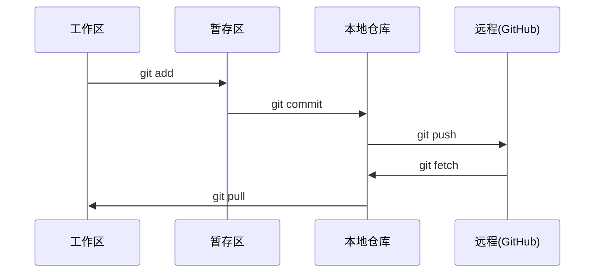

# 00-setup-and-tooling · 02-git-and-collaboration 学习笔记

> 科目：AI 工程课程（ai-engineering-from-scratch）
> 阶段：Phase 0 Setup & Tooling · 第二小节 Git & Collaboration
> 类型：Learn · 语言：--
> 日期：2026-08-28
> 状态：✅ 完成（含实战练习）

---

## 0. 核心概念：版本控制四要素

| 术语 | 人们说 | 实际含义 |
|---|---|---|
| Commit | "保存" | 整个项目在某一时刻的**快照**（不是保存单个文件） |
| Branch | "一份拷贝" | 指向某个提交的**指针**，随工作前进 |
| Merge | "合并代码" | 把一个分支的改动应用到另一个分支 |
| Remote | "云端" | 托管在别处的仓库副本（GitHub） |

**三个要点：**
1. 常提交（git commit）
2. 推远程（git push）
3. 实验开分支（git checkout -b experiment）

**提交顺序口诀：add → commit → push**（先暂存 → 再快照 → 后备份）

## 1. 数据流向图



## 2. 日常命令及作用

```bash
git config --global user.name "dyzlog"          # 配置身份（一次）
git config --global user.email "you@qq.com"      # 配置邮箱（一次）
git status                                        # 看工作区状态（最常用）
git add file.py                                   # 暂存：把文件放进暂存区
git commit -m "Add perceptron"                    # 快照：提交到本地仓库
git push origin main                              # 备份：推到 GitHub
git pull origin main                              # 拉取：同步远程到本地
git fetch origin                                  # 只下载远程信息，不合并
git checkout -b experiment                        # 新建分支并切换
git checkout main                                 # 切回主分支
git merge experiment                              # 合并实验分支到当前分支
git log --oneline                                 # 查看提交历史（一行一条）
git log --oneline -- phases/00-setup-and-tooling  # 只看某目录的提交
git branch                                        # 列出本地分支
git branch -D <name>                              # 删除本地分支
git push origin --delete <name>                   # 删除远程分支
git remote -v                                     # 查看远程仓库地址
```

## 3. 本机实践：三端同步架构

课程仓库三地同步（**只同步代码，不同步环境**）：

```text
WSL 主战场 ⇄ GitHub（dyzlog/ai-engineering）⇄ G 盘 AI 协作镜像
```

| 位置 | 路径 | 角色 |
|---|---|---|
| WSL | ~/projects/ai-engineering | 写代码 + venv（主战场） |
| GitHub | git@github.com:dyzlog/ai-engineering.git | 同步中枢（SSH 走 443） |
| G 盘 | G:\github\ai-engineering-from-scratch | AI 助手读代码/review |

日常循环：WSL 改代码 → git add/commit/push → G 盘 git pull → AI 改 G 盘 → push → WSL git pull

## 4. 分支策略（本机采用方案 B：main 一条龙）

**决策**：main 唯一分支，个人文件放独立目录隔离，课程更新时 pull merge 自动处理。

```text
main（唯一分支）
├── phases/                    # 课程代码（不碰）
├── NOTE/                      # 个人笔记（本文件所在）
└── learning-artifacts/        # 练习产物
```

**铁律：**
1. 个人文件只放 NOTE/ 和 learning-artifacts/，课程文件（phases/、docs/）不碰 → merge 永不冲突；
2. 课程更新：git pull origin main 即可；
3. 曾误建 my-progress 分支（方案 A 残留），已清理：本地 git branch -D + 远程 git push origin --delete。

## 5. 遇到的问题及解决

| 问题 | 现象 | 原因 | 解决 |
|---|---|---|---|
| 🔴 divergent branches | `git pull` 报 "Need to specify how to reconcile divergent branches" | WSL 本地 main 停在孤儿提交（原作者 site 构建残留 6571f543/39ea8a1c），与 GitHub 主线分叉 | `git fetch origin && git reset --hard origin/main` 对齐；配 `git config pull.rebase false` |
| 🟡 孤儿提交 | WSL 领先 2 个、落后 1 个 | clone 原作者仓库时带的旧历史（原作者 force push 改写主线） | 确认无价值后 reset 丢弃（可先 branch 备份） |
| 🟡 误建 my-progress | 方案 A 的分支被创建并 push | 用户执行了方案 A 命令 | 本地 + 远程都删除 |
| 🟡 G 盘远程引用噪音 | remotes/origin/feat/* 等 17 个分支 | 原作者仓库的远程分支引用被 clone 带过来 | `git fetch origin --prune` 清理 |

## 6. .gitignore 要点

- 课程仓库已内置模型文件忽略规则：`*.pt` / `*.pth` / `*.safetensors`（模型检查点大且可重建）
- .venv/ 也被忽略（环境不进 git）
- 用 `git check-ignore <file>` 验证某个文件是否被忽略

## 7. 关键命令速查

| 场景 | 命令 |
|---|---|
| 看状态 | git status -sb |
| 保存工作 | git add -A && git commit -m "..." |
| 备份云端 | git push origin main |
| 同步最新 | git pull origin main |
| 实验分支 | git checkout -b name |
| 合并 | git merge name |
| 看历史 | git log --oneline |
| 看远程 | git remote -v |

## 8. 记忆口诀

1. **add → commit → push**：先暂存、再快照、后备份；
2. **提交要勤**：常 commit，实验开分支；
3. **方案 B 三条**：个人文件只进 NOTE/ 和 learning-artifacts/、课程文件不碰、pull 即同步；
4. **分叉不可怕**：fetch + reset --hard origin/main 对齐（无本地成果时）；
5. **仓库保持单 main**：GitHub 上只有 main 一个分支最干净。
